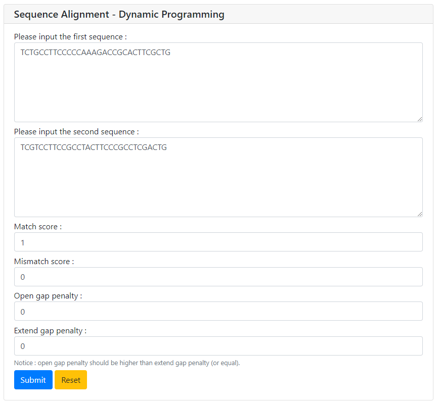
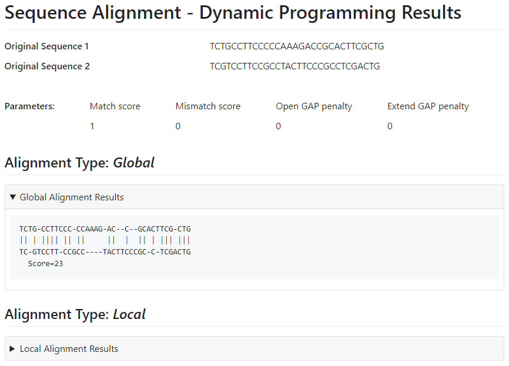

# Sequence Alignment Algorithm - Dynamic Programming (SAADP)

- [Sequence Alignment Algorithm - Dynamic Programming (SAADP)](#sequence-alignment-algorithm---dynamic-programming-saadp)
  - [Requirement](#requirement)
  - [Usage](#usage)
  - [Example](#example)

## Requirement
*To use the current release*
```shell
$ pip install pywebio
$ pip install biopython
```

## Usage
*Try this program locally*
```shell
$ python SAADP.py
```
*Then visit the website:* **[http://127.0.0.1:8080](http://127.0.0.1:8080)** *or* **[http://localhost:8080](http://localhost:8080).**

## Example
*User interface*

*Output*


**SAADP   © weylz 2023. All rights reserved.**